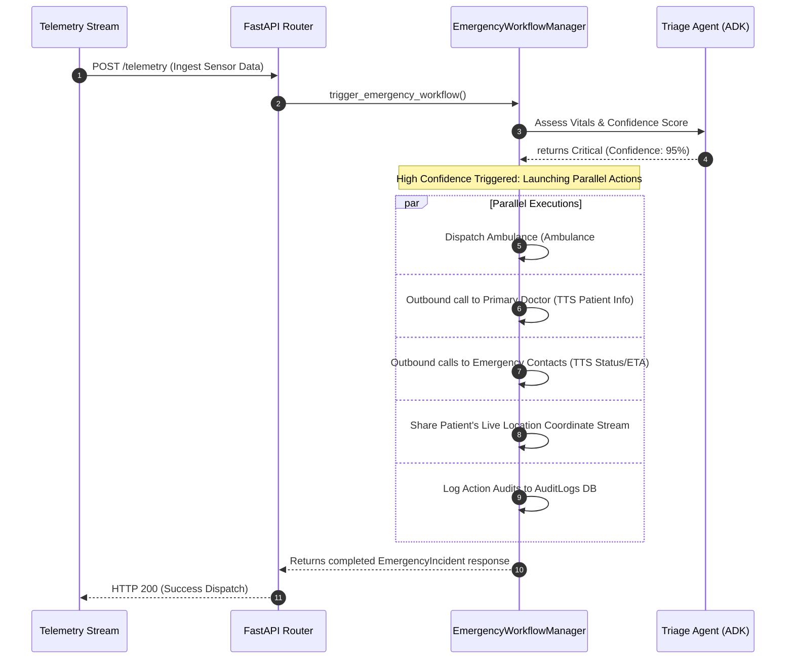

# LifeLink AI - Architectural Blueprint 🏛️

This document describes the architectural layout, communication boundaries, and clean design patterns implemented in **LifeLink AI**.

## Clean Architecture Principles

LifeLink AI is structured according to Clean Architecture concepts, separating the application into four distinct rings of responsibility:

```text
       ┌─────────────────────────────────────────────────────────┐
       │                        Frameworks                       │
       │           (FastAPI, Uvicorn, Streamlit, SQLite)         │
       │                                                         │
       │       ┌─────────────────────────────────────────┐       │
       │       │                Adapters                 │       │
       │       │    (SQLAlchemy Repos, FastAPI Routers)  │       │
       │       │                                         │       │
       │       │       ┌─────────────────────────┐       │       │
       │       │       │       Application       │       │       │
       │       │       │  (Use Cases & Services) │       │       │
       │       │       │                         │       │       │
       │       │       │       ┌─────────┐       │       │       │
       │       │       │       │ Domain  │       │       │       │
       │       │       │       │ (Models)│       │       │       │
       │       │       │       └─────────┘       │       │       │
       │       └─────────────────────────────────────────┘       │
       └─────────────────────────────────────────────────────────┘
```

1. **Domain Layer (`backend/models/`)**: Specifies core business entities (`User`, `EmergencyHealthProfile`, `Doctor`, `EmergencyContact`, `EmergencyIncident`) completely decoupled from database engine drivers or web interfaces.
2. **Application Layer (`backend/services/`, `backend/orchestrator/`)**: Core application logic. Contains the AI Agents defined using the Google Agent Development Kit (ADK) and the `EmergencyWorkflowManager`.
3. **Interface Adapters (`backend/api/`, `backend/mcp/`)**: Bridges controllers and endpoints. Receives web traffic, parses schemas via Pydantic, and handles Model Context Protocol (MCP) data tool mappings.
4. **Infrastructure Layer (`backend/database/`, `backend/config/`)**: Database engines, configurations, migrations, external server bindings.

---

## 🚦 Parallel Incident Orchestration Pipeline

When an emergency telemetry event is ingested, the system assesses the vitals using the Triage Agent. If the assessment yields a **confidence score >= 0.8** and classifies the event as **critical**, the orchestrator initiates a parallel dispatch workflow to bypass sequential blockages.



## Module Independence Rules
- **No Circular Imports**: Submodules do not import from parents. Communication goes downwards.
- **Pydantic Validation**: All data traversing the network boundaries is verified by `backend/schemas/`.
- **Database Dependency Injection**: Database sessions (`SessionLocal`) are never globally imported inside services or API routes; they are yielded through FastAPI's `Depends(get_db)` to ensure isolated transaction scopes.
